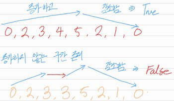
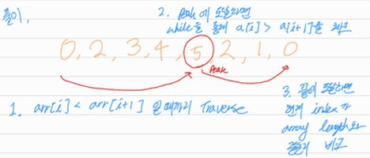

# Valid Mountain Array

## 1. 문제 설명

주어진 정수 배열 `arr`이 mountain array인지를 반환하여라.

Mountain array란:

- 'arr.length >= 3'
- 어래이에는 `i`가 존재하는데, 다음과 같은 조건을 만족하는 `i`가 존재하는 어래이다.
    - `arr[i] > arr[i + 1] > ... > arr[arr.length - 1]`.
    - `arr[0] < arr[1] < ... < arr[i - 1] < arr[i]`.



### Example 1:

```
Input: arr = [2,1]
Output: false
```

### Example 2:

```
Input: arr = [3,5,5]
Output: false
```

### Example 3:

```
Input: arr = [0,3,2,1]
Output: true
```

### Constraints:

- `1 <= arr.length <= 104`
- `0 <= arr[i] <= 104`

## 2. 문제 풀이



1. 어래이를 횡단하는 `i`포인터 생성.
2. `while`을 통해 `arr[i] < arr[i + 1]`가 성립할 때까지 traverse.
3. 이후로는 `arr[i] > arr[i + 1]`가 성립할 때까지 traverse.
4. 현재까지 이동한 `i`가 어래이의 마지막 인덱스 `N - 1`와 같으면 `True`.

## 3. 시간 복잡도 & 공간 복잡도

전체 입력 리스트를 한번만 횡단하면 되기 때문에 시간 복잡도는 $O(N)$,  
공간 복잡도는 새로운 list 를 생성하지 않기 때문에 $O(1)$.

## 4. 코드

```python
def valid_mountain_array(arr):
    N = len(arr)
    i = 0

    # walk up
    while i + 1 < N and arr[i] < arr[i + 1]:
        i += 1

    # peak can't be first or last
    if i == 0 or i == N - 1:
        return False

    # walk down
    while i + 1 < N and arr[i] > arr[i + 1]:
        i += 1

    return i == N - 1
```