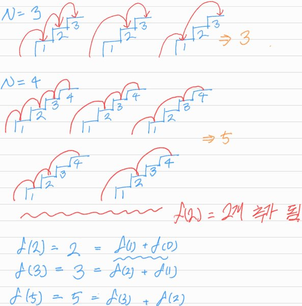

# Climbing Stairs

## 1. 문제 설명

정수 `n`이 주어지고 `n`개의 계단을 오르기위해 한번에 1계단과 2계단 오를 수 있다고 할 때, 총 경우의 수를 반환하라.

### Example 1:

```
Input: n = 2
Output: 2
Explanation: There are two ways to climb to the top.
1. 1 step + 1 step
2. 2 steps
```

### Example 2:

```
Input: n = 3
Output: 3
Explanation: There are three ways to climb to the top.
1. 1 step + 1 step + 1 step
2. 1 step + 2 steps
3. 2 steps + 1 step
```

### Constraints:

- `1 <= n <= 45`

## 2. 문제 풀이



`f(1) = 1`, `f(0) = 0`이고, 그림과 같이 `N=3`일 떄와 `N=4`일 때를 전개해봤을 때 다음과 같은 식을 전개할 수 있다.

- `f(2) = 2 = f(1) + f(0)`
- `f(3) = 3 = f(2) + f(1)`
- `f(4) = 5 = f(3) + f(2)`
- `f(N) = f(N - 1) + f(N - 2)`

따라서 경우의 수를 위와 같이 `f()`를 재귀함수로 구현할 수 있다.

`f(N) = f(N - 1) + f(N - 2)`을 구하기 위해서는 계속해서 이미 이전에 구했던 값을 또 연산하는 현상이 발생한다.  
따라서 hash table을 이용한 memoization을 통해 이미 구했던 값을 memo해 놓는 방법을 사용해 시간 복잡도를 간소화할 수 있다.

## 3. 시간 복잡도 & 공간 복잡도

시간 복잡도는 계단을 오르는 경우의 수를 나타내는 tree의 depth인 N만큼에 비례한다 $O(N)$,  
공간 복잡도는 계단을 오르는 경우의 수를 나타내는 tree의 depth만큼의 재귀 호출로 인해 $O(N)$.

## 4. 코드

```python
from collections import defaultdict


def climb_stairs(n):
    def helper(n, memo):
        if n not in memo.keys():
            memo[n] = helper(n - 1, memo) + helper(n - 2, memo)

        return memo[n]

    memo = defaultdict(int)
    memo[0] = memo[1] = 1

    return helper(n, memo)
```