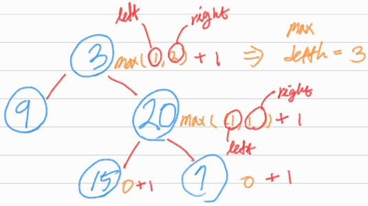

# Maximum Depth of Binary Tree

## 1. 문제 설명

이진 트리가 주어질 때, 이진 트리의 깊이를 반환하여라.

### Example 1:

```
Input: root = [3,9,20,null,null,15,7]
Output: 3
```

### Example 2:

```
Input: root = [1,null,2]
Output: 2
```

### Constraints:

- The number of nodes in the tree is in the range [0, 104].
- `-100 <= Node.val <= 100`

## 2. 문제 풀이



1. Base case는 현재 노드가 `None`일 때. Base case에서 `0`을 반환한다.
2. 각각의 엣지를 통해 depth를 종단하면서 depth count를 +1 한다.
3. 현재 노드의 오른쪽 또는 왼쪽 각각의 엣지의 depth를 비교해서 더 큰 depth를 현재 depth로 결정한다.

## 3. 시간 복잡도 & 공간 복잡도

### 시간 복잡도

- 시간 복잡도는 이진 트리의 노드 개수인 N만큼 비례한다 $O(N)$.

### 공간 복잡도

- 공간 복잡도는 이진 트리구조가 왼쪽으로만 연결된 구조라면 worst case이고 이때는 노드 개수 만큼의 재귀 호출로 인해 $O(N)$.
- 만약 트리 구조가 완전한 균형상태이면 상대적으로 깊이가 얕아져 재귀호출이 줄어들게 된다. 이때는 best case이고 공간 복잡도는 $O(log(N))$이다.

## 4. 코드

```python
# Definition for a binary tree node.
# class TreeNode:
#     def __init__(self, val=0, left=None, right=None):
#         self.val = val
#         self.left = left
#         self.right = right


def max_depth(root):
    if root is None:
        return 0
    return 1 + max(max_depth(root.left), max_depth(root.right))
```