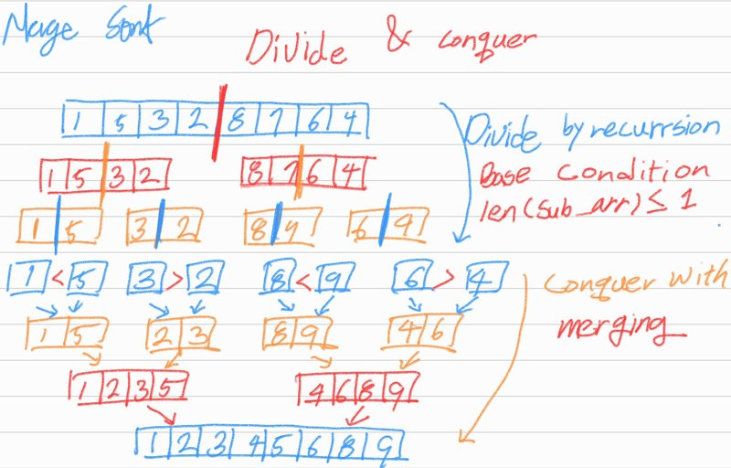

# Merge sort

## 1. 문제 설명

merge sort를 재귀로 구현하여라.

### Example 1:

```
Input: nums = [5,2,3,1]
Output: [1,2,3,5]
Explanation: After sorting the array, the positions of some numbers are not changed (for example, 2 and 3), while the positions of other numbers are changed (for example, 1 and 5).
```

### Example 2:

```
Input: nums = [5,1,1,2,0,0]
Output: [0,0,1,1,2,5]
Explanation: Note that the values of nums are not necessairly unique.
```

### Constraints:

- `1 <= nums.length <= 5 * 104`
- `-5 * 104 <= nums[i] <= 5 * 104`

## 2. 문제 풀이



1. 어래이가 하나의 값을 가진 sub array로 분리 될 때 까지를 base case로 정의하고 재귀를 통해 분리.
2. 분리된 각각의 sub array를 두개씩 짝지어 sorting과 동시에 합친다.

## 3. 시간 복잡도 & 공간 복잡도

### 시간 복잡도

시간 복잡도는 전반적인 재귀의 수는 점점 절반으로 줄어들기 때문에 $O(logN)$과 각 패스에서 병합할 때 모든 값들을 비교해야하 하므로 $O(N)$이 소요된다. 따라서 총 시간 복잡도는 $O(NlogN)$,

### 공간 복잡도

공간 복잡도는 두개의 배열을 병합할 때 병합 결과를 담아 놓을 배열이 필요하기 때문에 $O(N)$.

## 4. 코드

```python
def sort_array(nums):
    def merge_sort(nums):
        len_nums = len(nums)

        # Base case: split into individual elements
        if len_nums <= 1:
            return nums

        pivot = len_nums // 2

        left_list = merge_sort(nums[0: pivot])
        right_list = merge_sort(nums[pivot: len_nums])

        left_cursor = right_cursor = 0

        ret = []
        while len(left_list) > left_cursor and len(right_list) > right_cursor:
            if left_list[left_cursor] < right_list[right_cursor]:
                ret.append(left_list[left_cursor])
                left_cursor += 1
            else:
                ret.append(right_list[right_cursor])
                right_cursor += 1

        ret.extend(left_list[left_cursor:])
        ret.extend(right_list[right_cursor:])

        return ret

    return merge_sort(nums)
```