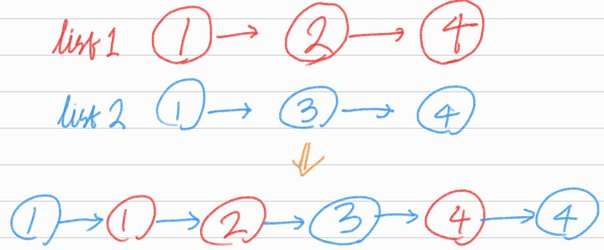
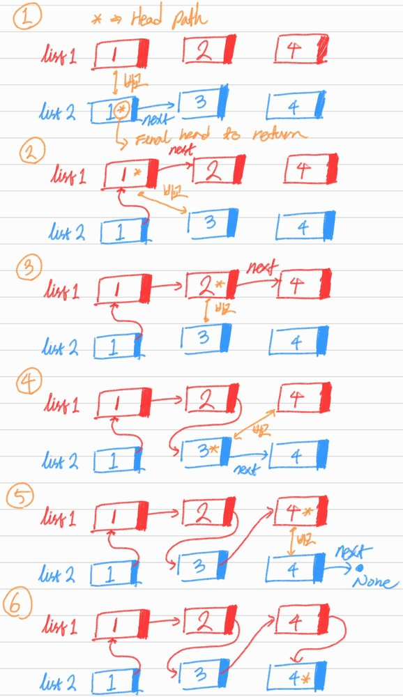

# Merge Two Sorted Lists

## 1. 문제 설명

두개의 정렬된 링크드 리스트 `list1`과 `list2`가 주어지면 둘을 합쳐 하나의 정렬된 링크드 리스트로 만드는 함수를 작성하여라.  
이때 함수는 합쳐진 링크드 리스트의 head를 반환하여라.



### Example 1:

```
Input: list1 = [1,2,4], list2 = [1,3,4]
Output: [1,1,2,3,4,4]
```

### Example 2:

```
Input: list1 = [], list2 = []
Output: []
```

### Example 3:

```
Input: list1 = [], list2 = [0]
Output: [0]
```

### Constraints:

- The number of nodes in both lists is in the range [0, 50].
- `-100 <= Node.val <= 100`
- Both list1 and list2 are sorted in non-decreasing order.

## 2. 문제 풀이



1. Base case는 둘 중 하나의 링크드 리스트를 모두 횡단할 때 이다. 하나의 리스트를 모두 횡단한다면 또 다른 리스트의 나머지 부분을 이어 붙힌다.
2. 만약 예를 들어 `list1`의 현재 노드의 값이 `list2`의 현재 노드의 값보다 작을 때, `list1`의 다음 노드(`list1.next`)는 `list1.next`노드와 `list2`노드 중 작은
   노드가 된다.
3. 2번 조건을 재귀로 반복하여 `list1`와 `list2`중 하나가 최종 노드에 도달하면 다른 링크드 리스트의 남은 리스트를 반환하며 종료.

## 3. 시간 복잡도 & 공간 복잡도

### 시간 복잡도

시간 복잡도는 입력 링크드 리스트 두개를 횡단해야하기 떄문에 $O(N + M)$. N은 `list1`의 길이, M은 `list2`의 길이이다.

### 공간 복잡도

공간 복잡도는 두 링크드 리스트들을 횡단하면서 발생하는 재귀 호출로 인해 마찬가지로 $O(N + M)$.

## 4. 코드

```python
# Definition for singly-linked list.
# class ListNode:
#     def __init__(self, val=0, next=None):
#         self.val = val
#         self.next = next

def merge_two_lists(list1, list2):
    if list1 is None:
        return list2

    elif list2 is None:
        return list1

    elif list1.val < list2.val:
        list1.next = merge_two_lists(list1.next, list2)
        return list1

    else:
        list2.next = merge_two_lists(list1, list2.next)
        return list2
```