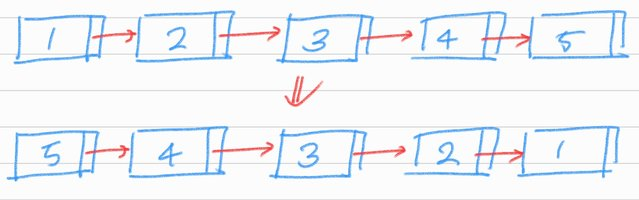
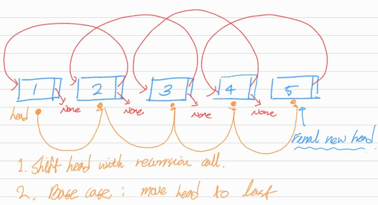

# Reverse Linked List

## 1. 문제 설명

주어진 링크드 리스트를 뒤집는 함수를 작성하여라.  
링크드 리스트 내부 `value`를 수정하지 않아야 한다.



### Example 1:

```
Input: head = [1,2,3,4,5]
Output: [5,4,3,2,1]
```

### Example 2:

```
Input: head = [1,2]
Output: [2,1]
```

### Example 3:

```
Input: head = []
Output: []
```

### Constraints:

- The number of nodes in the list is the range [0, 5000].
- `-5000 <= Node.val <= 5000`

## 2. 문제 풀이



1. Base case를 현재 노드 또는 다음 노드가 `None`일 때 현재 노드를 반환하는 것으로 설정한다.
2. Base case 까지 링크드 리스트를 횡단하면서 `head`를 맨 마지막 노드로 이동하게 한다.
3. `head`를 이동하면서 `head.next.next`를 현재 `head`로 하여 다음 노드가 현재 노드를 다음 노드로써 바라보게 한다. `head.next`는 `None`으로 설정한다.
   ```python 
   head.next.next = head 
   head.next = None
   ```

## 3. 시간 복잡도 & 공간 복잡도

시간 복잡도는 전체 입력 링크드 리스트를 한번만 횡단하면 되기 때문에 $O(N)$,  
공간 복잡도는 링크드 리스트를 횡단하면서 발생하는 재귀 호출로 인해 $O(N)$.

## 4. 코드

```python
# Definition for singly-linked list.
# class ListNode:
#     def __init__(self, val=0, next=None):
#         self.val = val
#         self.next = next


def reverse_list(head):
    if head is None or head.next is None:
        return head

    p = reverse_list(head.next)
    head.next.next = head
    head.next = None
    return p
```