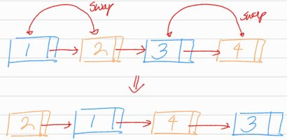
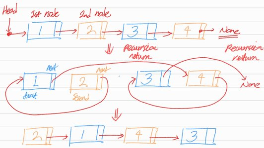

# Swap Nodes in Pairs

## 1. 문제 설명

주어진 링크드 리스트에서 매 인접한 노드들을 swap하는 함수를 작성하라.  
링크드 리스트 내부 `value`를 수정하지 않아야 한다.



### Example 1:

```
Input: head = [1,2,3,4]
Output: [2,1,4,3]
```

### Example 2:

```
Input: head = []
Output: []
```

### Example 3:

```
Input: head = [1]
Output: [1]
```

### Constraints:

- The number of nodes in the list is in the range [0, 100].
- `0 <= Node.val <= 100`

## 2. 문제 풀이



1. 2단계 점프로 링크드 리스트를 재귀하며 횡단한다.
2. 다음 쌍으로 건너뛰기 전에 `first_node`와 `second_node`노드 쌍을 swap한다.
   ```python 
   first_node.next = second_node.next
   second_node.next = first_node
   ```
3. 다음 쌍도 위와 같이 swap하고 이전 재귀의 `second_node.next`를 이번 재귀의 `second_node`와 연결한다.

## 3. 시간 복잡도 & 공간 복잡도

시간 복잡도는 전체 입력 링크드 리스트를 한번만 횡단하면 되기 때문에 $O(N)$,  
공간 복잡도는 링크드 리스트를 횡단하면서 발생하는 재귀 호출로 인해 $O(N)$.

## 4. 코드

```python
# Definition for singly-linked list.
# class ListNode:
#     def __init__(self, val=0, next=None):
#         self.val = val
#         self.next = next


def swap_pairs(head):
    if not head or not head.next:
        return head

    first_node = head
    second_node = head.next

    first_node.next = swap_pairs(second_node.next)
    second_node.next = first_node

    return second_node
```