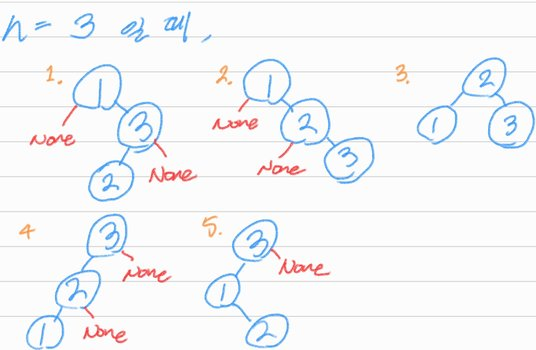

# Unique Binary Search Trees

## 1. 문제 설명

정수 `n`이 주어질 때 `n`개의 노드를 가지는 모든 경우의 binary search tree (BST)를 반환하여라.


### Example 1:

```
Input: n = 3
Output: [[1,null,2,null,3],[1,null,3,2],[2,1,3],[3,1,null,null,2],[3,2,null,1]]
```

### Example 2:

```
Input: n = 1
Output: [[1]]
```

### Constraints:

- `1 <= n <= 8`

## 2. 문제 풀이

1. `1`에서부터 `n`까지 root node가 `i`인 BST의 모든 경우의 수를 구하여 종합하는 방법으로 문제를 해결한다.
2. 위 그림에서 `i`는 현재의 root node를 나타낸다. Root node `i`의 left sub-tree의 모든 경우와 right sub-tree의 모든 경우를 root node에 각각 이어 붙여 각각의
   유일한 BST를 구성한다.
3. 현재 root node인 `i`의 left sub-tree들은 노드들의 root node가 `1, ..., i-1`인 sub-tree들을 구하면 되고, right sub-tree들은 노드들의 root
   node가 `i+1, ..., n`들인 sub-tree들을 구하면 된다.
   
4. 결국 하나의 BST는 여러 sub-tree들이 재귀적으로 구성되어있는 형태이다.
5. Sub-tree들을 구성하기 위한 index인 `start`와 `end`를 정한다. left sub-tree은 `start`가 `1`, `end`는 `i-1`인 경우들, right
   sub-tree은 `start`가 `i+1`, `end`는 `n`인 경우들이다.
6. `start`부터 `end`까지 재귀적으로 모든 경우의 sub-tree들을 구성하다가 `start > end`가 되는 지점에서 `None`을 리턴하는 base case를 만든다.
7. 최종으로는 각각의 left sub-tree, right sub-tree에 대해 `i` 노드를 생성하고 이를 `left`와 `right`에 각각이어 붙이면 유일한 BST를 구성할 수 있다.

## 3. 시간 복잡도 & 공간 복잡도

**앞서 $C_{n}$은 조합(combination)을 표현하는것이 아니고 카탈랑 수를 표현한 것이다.**

시간 복잡도는 이진 트리의 경우의 수를 세는 카탈랑 수 (Catalan number)로 표현하여 보통 $O(nC_{n})$으로 정의한다.  
공간 복잡도는 시간 복잡도와 같게 발생하는 재귀 호출로 인해 $O(nC_{n})$.

## 4. 코드

```python
# Definition for a binary tree node.
class TreeNode:
    def __init__(self, val=0, left=None, right=None):
        self.val = val
        self.left = left
        self.right = right


def generate_trees(n):
    def helper(start, end):

        if start > end:
            return [None, ]

        all_trees = []

        # Pick up a root
        for idx in range(start, end + 1):

            # All possible left sub-trees if idx is choosen to be a root
            left_trees = helper(start, idx - 1)

            # All possible right sub-trees if idx is choosen to be a root
            right_trees = helper(idx + 1, end)

            for l in left_trees:
                for r in right_trees:
                    curr_tree = TreeNode(idx)
                    curr_tree.left = l
                    curr_tree.right = r
                    all_trees.append(curr_tree)

        return all_trees

    return helper(1, n) if n else []
```