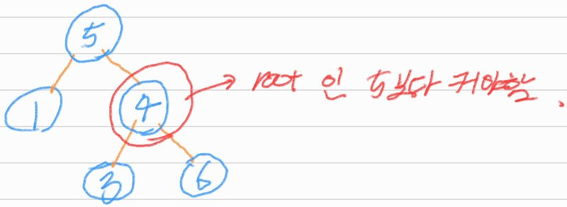
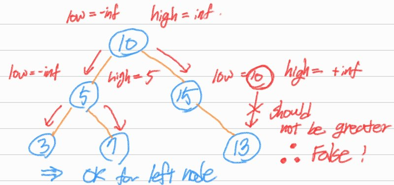

# Validate Binary Search Tree

## 1. 문제 설명

주어지는 Tree가 binary search tree인지를 반환하여  


### Example 1:

```
Input: root = [2,1,3]
Output: true

```

### Example 2:

```
Input: root = [5,1,4,null,null,3,6]
Output: false
Explanation: The root node's value is 5 but its right child's value is 4.
```

### Constraints:

- The number of nodes in the tree is in the range [1, 104].
- -231 <= Node.val <= 231 - 1

## 2. 문제 풀이



1. `upper_limit` 값과 `lower_limit` 값을 생성하고 각각 `-inf`와 `inf`로 초기화한다.
2. 현재 노드 값을 `upper_limit` 및 `lower_limit`과 비교한다.
3. 왼쪽 및 오른쪽 하위 트리에 대해 동일한 단계를 재귀적으로 반복한다.

## 3. 시간 복잡도 & 공간 복잡도

시간 복잡도는 모든 노드를 방문하기 때문에 $O(N})$. N은 노드 개수.  
공간 복잡도는 모든 노드를 방문하는 재귀이기 때문에 $O(N)$.

## 4. 코드

```python
# Definition for a binary tree node.
# class TreeNode:
#     def __init__(self, val=0, left=None, right=None):
#         self.val = val
#         self.left = left
#         self.right = right

def is_valid_bst(root):
    def validate(node, low=-float('inf'), high=float('inf')):

        if node is None:
            return True

        if node.val <= low or node.val >= high:
            return False

        return (validate(node.right, node.val, high) and
                validate(node.left, low, node.val))

    return validate(root)
```